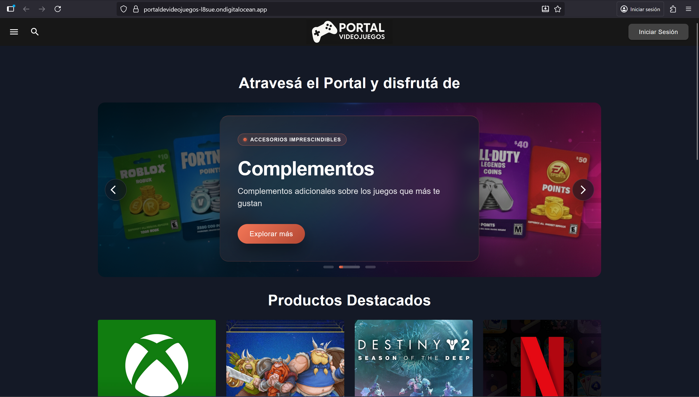
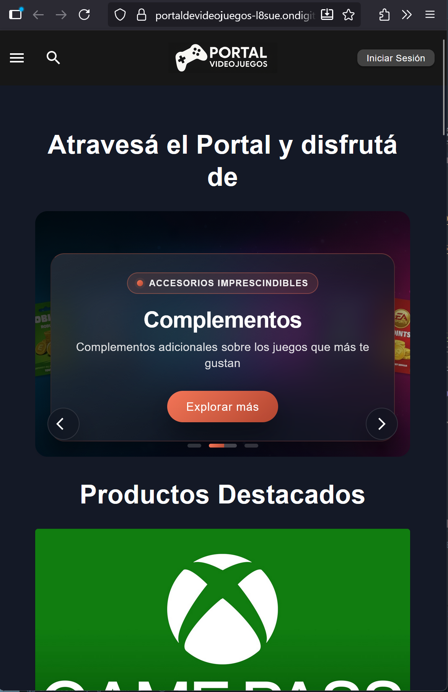
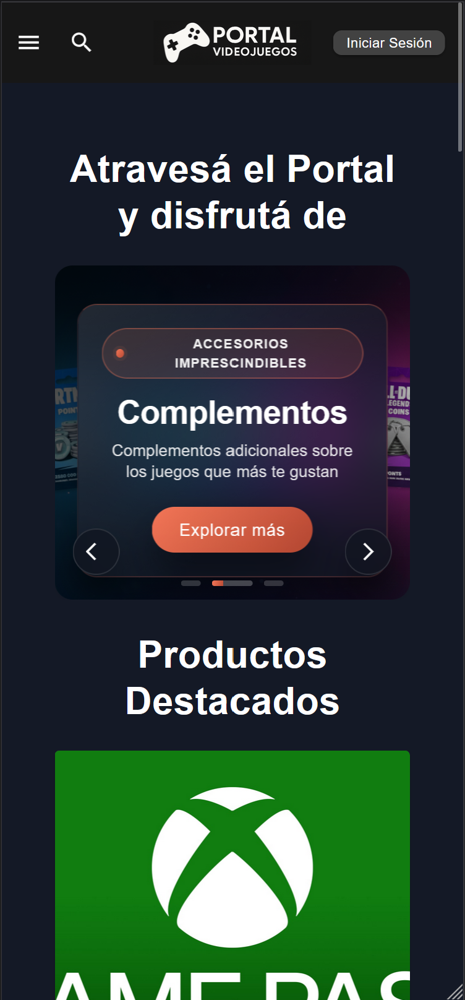
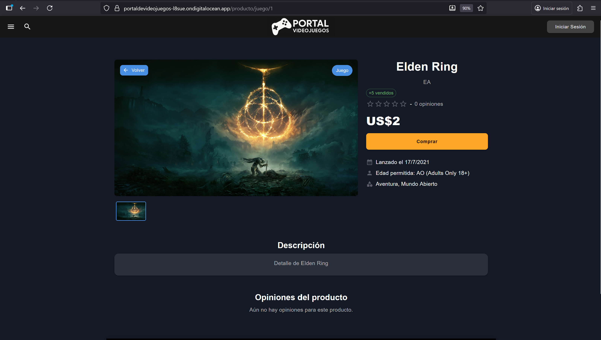
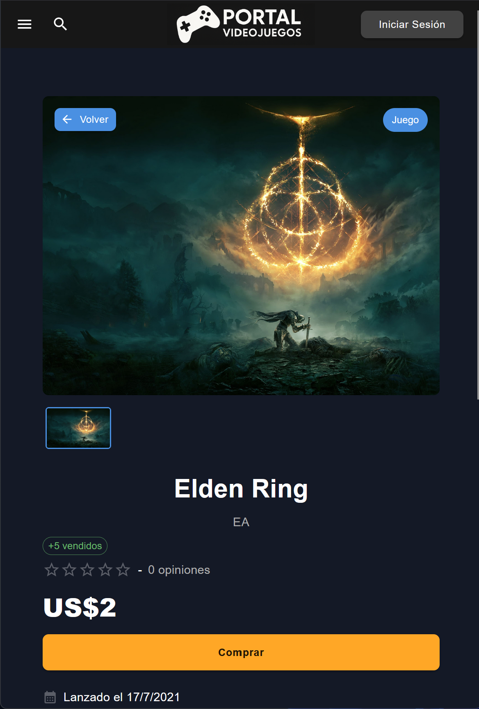
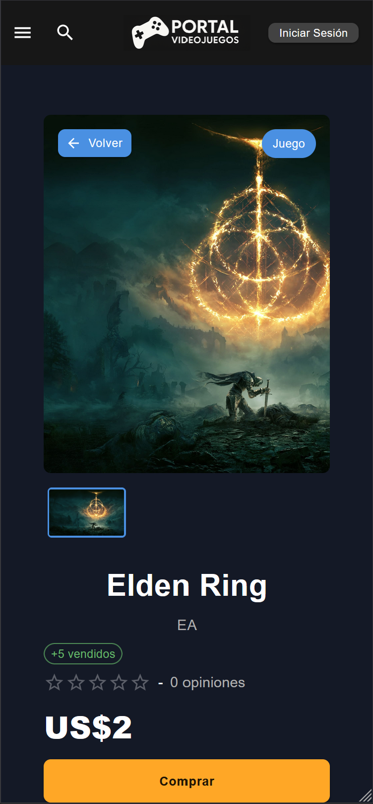
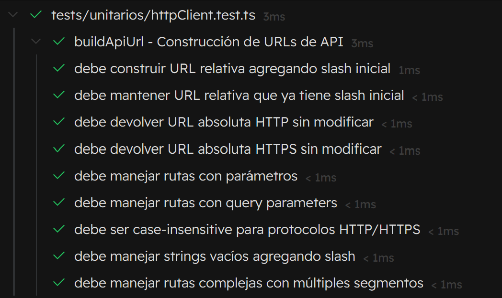
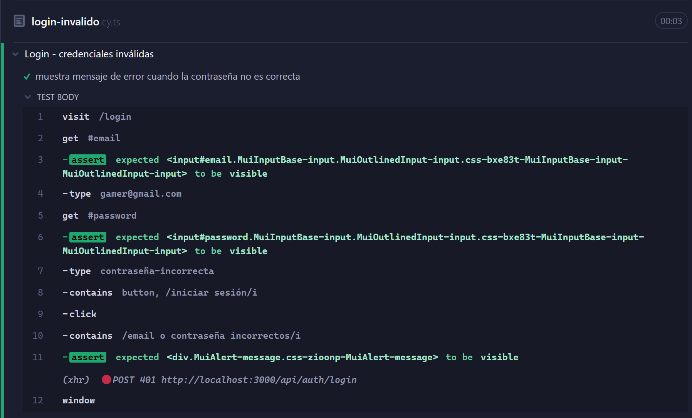
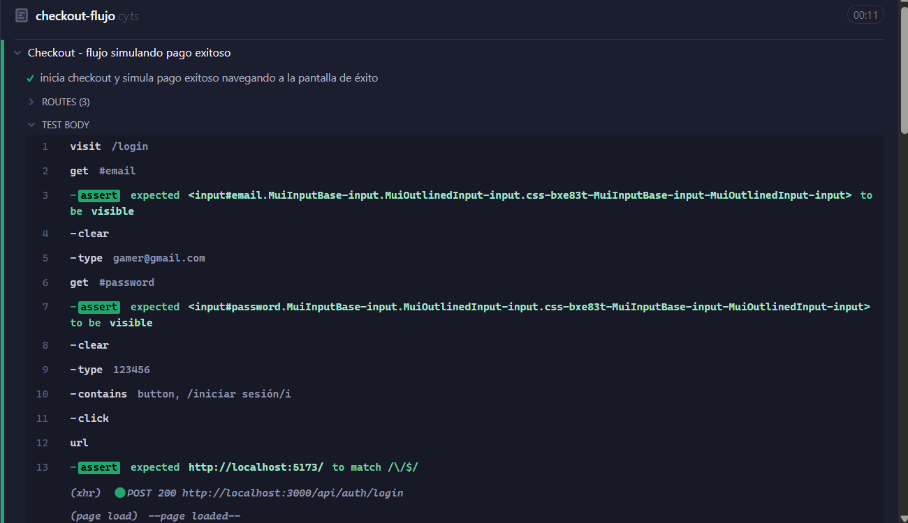

# Frontend de Portal de Videojuegos

## Integrantes:

- 52479, Brizio Augusto
- 52850, Conti Stéfano
- 53137, Vitali Bruno

## Indice:

<a href="#1-introduccion"><u>1. Introducción</u></a>

<a href="#2-instrucciones-de-instalación"><u>1. Instrucciones de instalación</u></a>

<a href="#3-instrucciones-para-su-uso"><u>3. Instrucciones para su uso</u></a>

<a href="#4-fotos-del-sitio"><u>4. Fotos del sitio</u></a>

<a href="#5-tests"><u>5. Tests</u></a>

## 1. Introdución

Para el desarrollo del frontend de nuestra aplicación nosotros usamos la herramienta Bundler **Vite** para un desarrollo ágil y continuo.

En cuanto al framework usamos **React** escrito en **TypeScript** y para mantener buenas prácticas de UX (consistencia de estilos, entre otras cosas) y además cumplir con la consigna de reutilizar componentes utilizamos la librería de componentes **MUI Components**.

## 2. Instrucciones de instalación

Todas las tecnologías utilizadas para el desarrollo y necesarias para el funcionamiento del backend están perfectamente documentadas en el **package.json**.

Para instalar las dependencias tendrá que abrir una terminal en la ruta **desarrollo-FE-tp/my-app** y ejecutar el comando **pnpm install** y automáticamente comenzarán las descargas de los paquetes necesarios.

_Nota:_ En el apartado de **Services** se encuentra un servicio llamado **httpClient** que se utiliza para definir un mismo cliente a usar en todos los servicios, de no coincidir el puerto puesto ahora para utilizar la API del Backend bastará con cambiarlo solo en ese servicio para que anden todos los servicios del Frontend.

## 3. Instrucciones para su uso

Para "correr" el Frontend de la aplicación bastará con dirigirse a la ruta **desarrollo-FE-tp/my-app** y ejecutar el comando **pnpm run dev** y automáticamente comenzará a correr el sitio en localhost, especificando a la salida de la terminal el puerto en uso.

## 4. Fotos del sitio 

A continuación mostramos algunos snapshots del sitio para mostrar la consistencia de estilos y que el sitio se visualiza correctamente en 3 breakpoints distintos.

**home.tsx**

_Breakpoint XL:_

_Breakpoint MD:_

_Breakpoint XS:_

**Producto.tsx:**

_Breakpoint XL:_

_Breakpoint MD:_

_Breakpoint XS:_

## 5. Tests

<a href="#51-test-unitario"><u>5.1 Test unitario</u></a>

<a href="#52-tests-e2e"><u>5.2 Tests E2E</u></a>

_Aclaración: todos los posibles scripts para correr los diferentes tipos de tests se encuentran bien explicados en el package.json. Nosotros siempre usamos los comandos para ejecutarlos con interfaces gráficas pero la elección está en las manos del tester._

 _Si la elección del tester es la misma que la nuestra, al ejecutar el comando para correr tests de Vitest con interfaz gráfica deberá escribir "y" en la consola para aceptar instalar la interfaz gráfica de Vitest ya que no viene instalada por defecto._

### 5.1 Tests unitarios

Para el testing unitario utilizamos la misma herramienta que en el Backend, **Vitest** ya que tenía una buena integración con **Vite**.

**httpClient.test.ts**

Testea el helper buildApiUrl asegurando que de que agregue la url base de la api de ser necesario o no (rutas relativas o absolutas), maneje ambos tipos de rutas http/https sin importar mayúsculas, mantenga parámetros de ruta, query strings y meneje strings vacíos añadiendo "/".

_Foto éxito:_

### 5.2 Tests E2E 

Para los tests End-to-End (E2E) utilizamos la herramienta **Crypess** ya que la curva de aprendizaje era bastante más amigable que Playwright y para los tests que necesitabamos realizar Cypress funcionaba perfecto.

_Nota: En el package.json se encuentran los scripts para correr los tests con Cypress y sus dependencias pero igualmente se necesita instalar Cypress manualmente para hacer uso del servicio. Esto se lleva a cabo viajando a la ruta **desarrollo-FE-tp/my-app** y ejecutando el comando **pnpm install cypress**._

**login.cy.ts**

Flujo de login exitoso: visita /login , introduce credenciales válidas ( gamer@gmail.com / 123456 ), hace clic en “Iniciar sesión”, verifica redirección al home y comprueba que se guardó el token en localStorage o sessionStorage.

_Foto éxito:_

**login-invalido.cy.ts**

Flujo con contraseña incorrecta: intenta iniciar sesión con la misma cuenta y contraseña inválida, espera el mensaje “email o contraseña incorrectos” y verifica que no se guardó ningún token.

_Foto éxito:_

**checkout-flujo.cy.ts**

Escenario integral de compra:
1. Hace login reutilizando una función auxiliar.
2. Visita directamente el detalle de un producto conocido del seed e intercepta su carga para continuar el flujo.
3. Inicia el checkout y espera la creación de sesión ( POST /api/checkout/start ).
4. Mockea POST /api/checkout/mp/start para evitar MercadoPago real.
5. Usa cy.request para re-llamar /checkout/start y luego /checkout/simulate-success , extrayendo sessionId, ventaId y codActivacion.
6. Visita manualmente /checkout/success con el venta_id y valida la UI ( Compra exitosa , código de activación).

_Foto éxito:_

